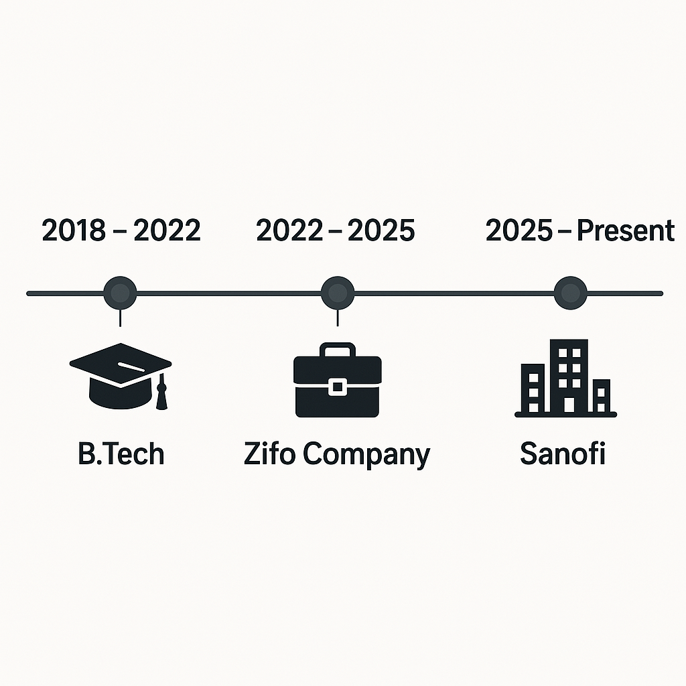
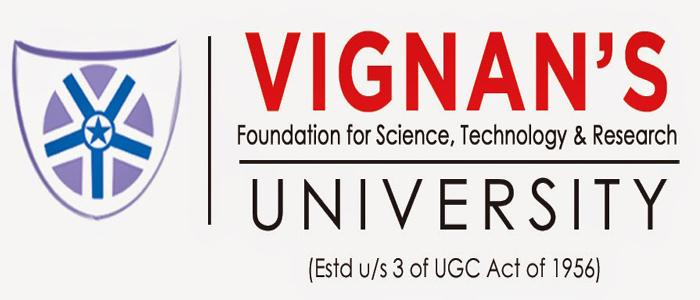
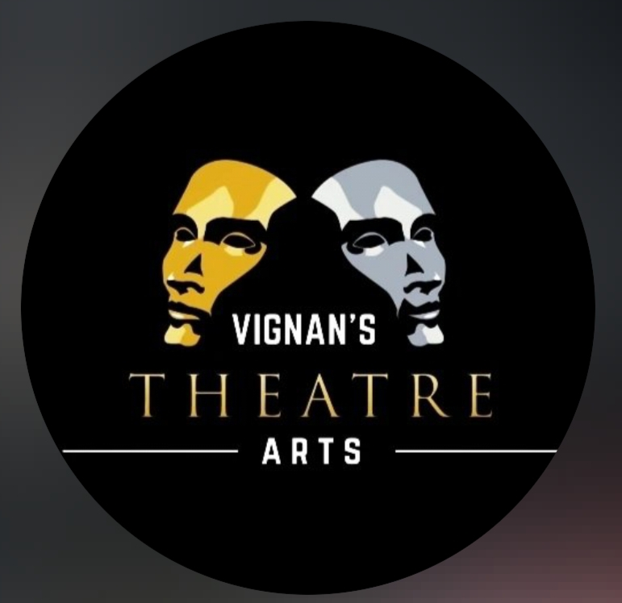
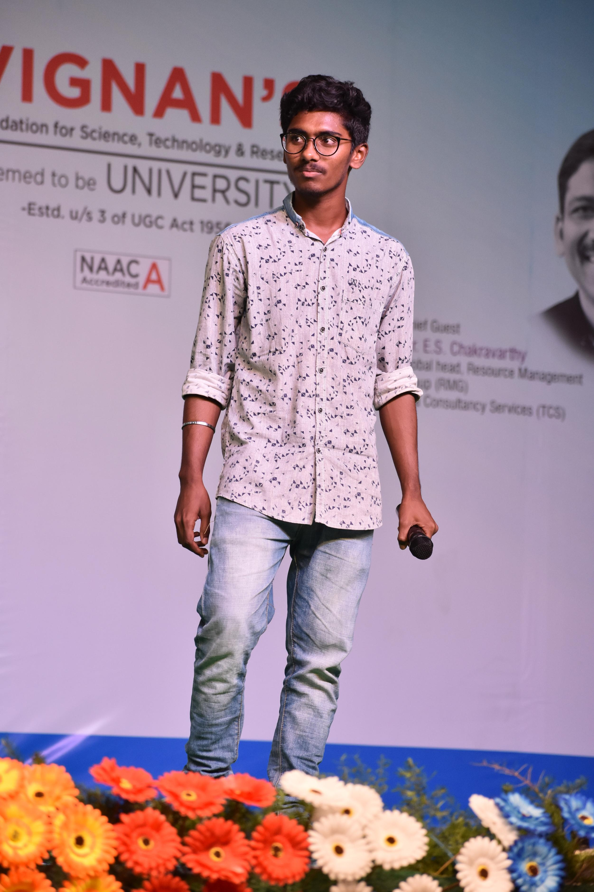
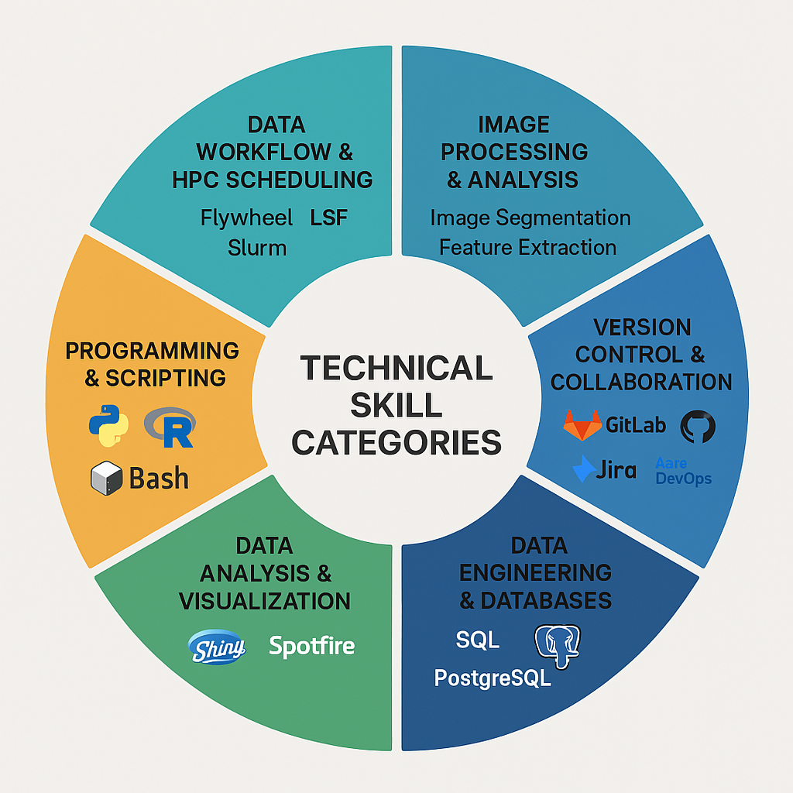

# 👨‍💻 Ajay Kumar Oruganti
**Senior Statistical Programmer** 
_Late Phase Team, SPAR_

---

---

## 🎓 Graduation
**Bachelor of Technology | 2018-2022 | BioTechnology**

  

---

### 🌟 My Participation in Vignan

<table>
  <tr>
    <td align="center"> <b>Theatre Arts</b></td>
    <td align="center"> <b>Stage</b></td>
    <td align="center"> <b>Kho-Kho</b></td>
  </tr>
</table>

---

## 💼 Professional Journey

**Zifo | 2022 - 2025**  

